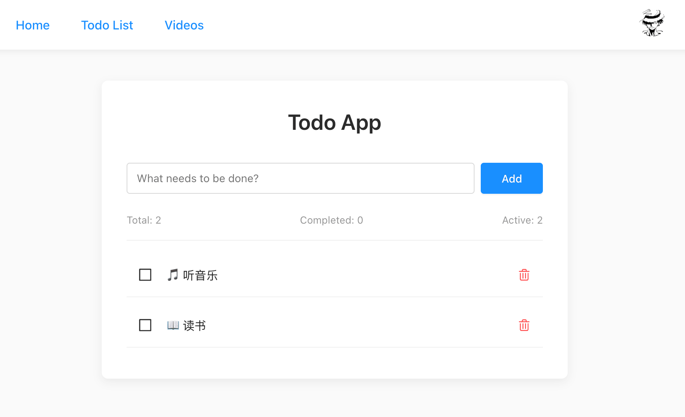

## yew app


一个使用 Rust 和 Yew 框架构建的现代化 Web 应用。

### ✨ 特性

- 🎨 现代化的 UI 设计和动画效果
- 📱 完整的响应式布局支持
- 💾 LocalStorage 数据持久化
- 🎯 统一的状态管理系统
- 🛠️ 完善的错误处理和加载状态
- 🎭 主题颜色系统
- ♿ 优化的用户体验

### 🚀 快速开始

```bash
# 安装 trunk (版本 0.21.x)
brew install trunk

# 开发模式
trunk serve --public-url ./

# 生产构建
trunk build --release --public-url ./

# 使用 http-server 预览
cd dist && http-server -p 8000 .

# Docker nginx 部署
# 访问 http://localhost:8000
docker-compose up -d

# GitHub Pages 部署
trunk build --release --public-url ./
```

### 📁 项目结构

```
src/
├── components/        # 可复用组件
│   ├── atoms/        # 基础组件 (Button, Input, Loading, Error)
│   └── icons/        # 图标组件
├── pages/            # 页面组件
│   ├── home.rs       # 首页
│   ├── login.rs      # 登录页
│   ├── todo_list.rs  # Todo 列表
│   ├── videos.rs     # 视频列表
│   └── not_found.rs  # 404 页面
├── utils/            # 工具模块
│   ├── theme.rs      # 主题颜色系统
│   └── storage.rs    # LocalStorage 封装
├── state.rs          # 全局状态管理
└── lib.rs            # 应用入口
```

### 🛣️ 路由

```rs
pub enum Route {
    #[at("/")]
    Home,
    #[at("/login")]
    Login,
    #[at("/todo_list")]
    TodoList,
    #[at("/videos")]
    Videos,
    #[not_found]
    #[at("/404")]
    NotFound,
}
```

[查看路由配置](./src/lib.rs)

### 📸 截图

#### Todo List


### 🔧 技术栈

- **Yew** 0.22.0 - Rust Web 框架
- **Yew Router** 0.19.0 - 路由管理
- **Stylist** 0.13.0 - CSS-in-Rust 样式方案
- **Serde** 1.0.210 - 序列化/反序列化
- **Reqwasm** 0.5.0 - HTTP 请求

### 📝 最近更新

查看 [OPTIMIZATION.md](./OPTIMIZATION.md) 了解详细的优化内容。

主要改进：
- ✅ 添加全局状态管理系统
- ✅ 实现 LocalStorage 数据持久化
- ✅ 优化所有页面的 UI 和交互
- ✅ 添加加载状态和错误处理
- ✅ 实现响应式设计
- ✅ 统一主题颜色系统
- ✅ 改进代码组织和类型安全

### 🤝 贡献

欢迎提交 Issue 和 Pull Request！

### 📄 许可证

查看 [License](./License) 文件了解详情。
